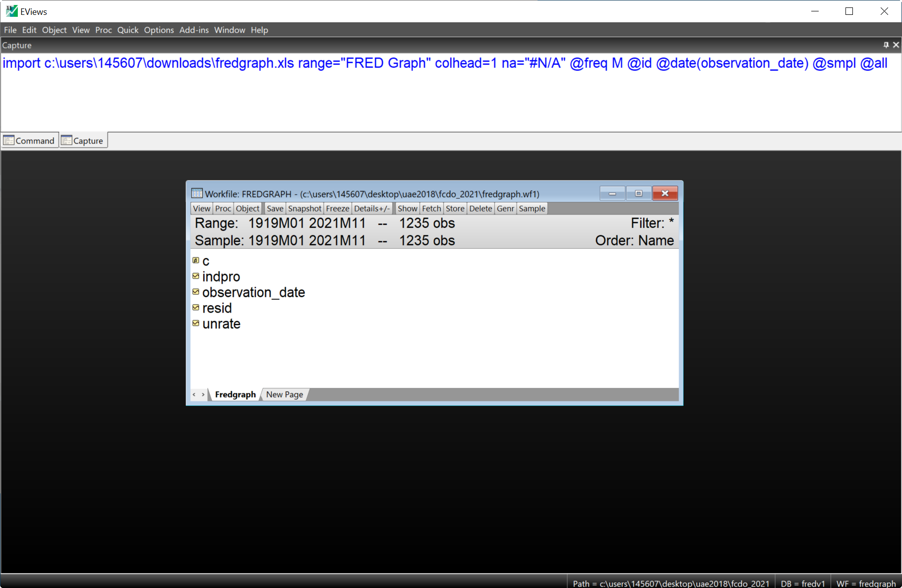
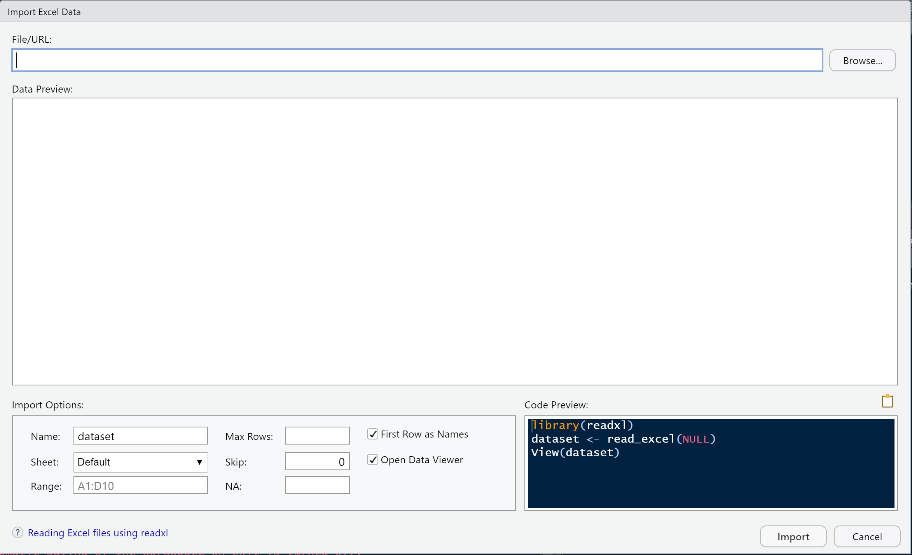
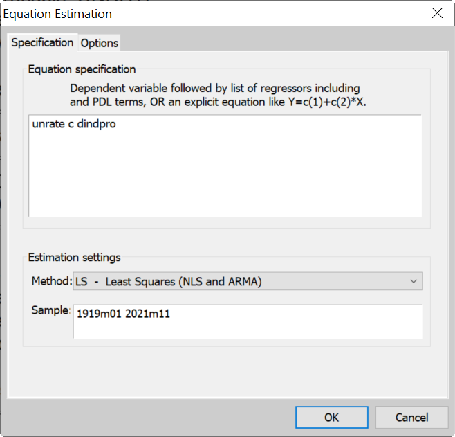
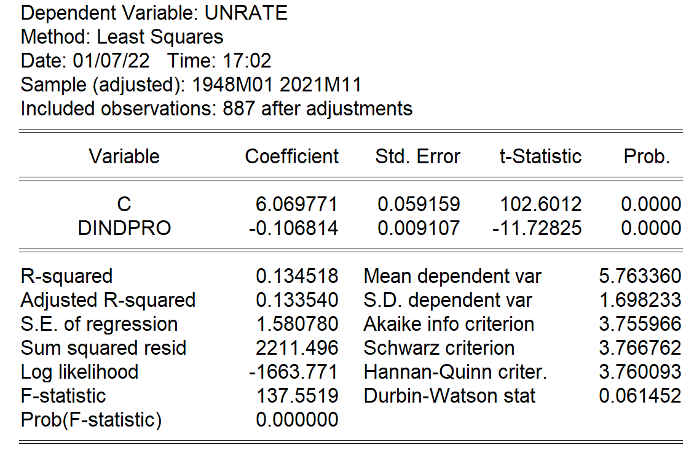

```{r setup, include=FALSE}
knitr::opts_chunk$set(echo = TRUE)
library(learnr)

fle <- "https://bankexchange/groups/2365/Shared%20Documents/fredgraph.xls"
download.file(fle, "data/fred2.xls", mode = "wb")
fred_data <- readxl::read_excel("data/fred2.xls",
                                col_types = c("date", "numeric", "numeric"),
                                skip = 11) 
```


## Introduction

This document is an introduction to how an applied economist might use R for some standard econometric exercises. It is intended to get someone to the stage of understanding what role bits of R play in setting up the kind of workflow achieved in a program like Eviews by following through the obvious menu-driven route. 

Good sources exist for doing this, but they require quite a bit of self study. The most obvious is [_Using R for Introductory Econometrics_](http://www.urfie.net/) by Florian Heiss, available free online and as a book. As with everything R, it all looks a bit overwhelming at first -- just like the first time someone is presented with a program like Matlab -- but it can be used routinely with not too much expert knowledge. 

I recommend using the `tidyverse` set of tools for standard econometrics, and that is used here. These are designed to work together, and cover everything we need _except for the econometrics_. Actually, that's not quite true but we will step out of the `tidyverse` for our modelling so we can use things that looks more familiar for that part of the problem. But for data manipulation and graphing of pretty big data sets the `tidyverse` is the way to go.

In what follows we're going to use some important bits of the `tidyverse` -- notably `ggplot` to plot and `mutate()`, `filter()`, `pivot_longer()` and a couple more to manipulate data.

## Data

A crucial part of econometric analysis is reading in the data to be analysed. R works well with all sorts of data formats (including its own) but Excel format is a common one, so let's look at that. In Eviews, Excel is a 'foreign data' import. In R it can be done in a similar interactive way through `Import Dataset`. I'll discuss this mostly programmatically though.

First we read some data downloaded from [FRED](https://fred.stlouisfed.org/) into Eviews, and then the same one in R. The following is where I've plotted two series, which were the US unemployment rate (`UNRATE`) and US industrial production (`INDPRO`) and then saved them to the default `fedgraph.xls`. Both are available at monthly frequency, and industrial production goes back to 1919. This is the Excel spreadsheet:

<br><center>

{width="75%"}

</center><br>

To import into Eviews, a user would open a dialog box via `File/New/Open Foreign Data as Workfile`. Opening the necessary file (`fredgraph.xls`) and clicking through the options will automatically load the data. Note Eviews will find (by default) the data and drop all the metadata at the top of the file. It also finds the date series.

Then this would open a desktop with a Workfile that looked something like this:

<br><center>

{width="75%"}

</center><br>

I've highlighted the 'capture' window, so we can see the underlying code that actually reads the Excel file, which I repeat here:

```{verbatim}
' Eviews code

import(link) data\fredgraph.xls range="FRED Graph"  
  colhead=1 namepos=custom colheadnames=("Name") na="#N/A" @freq M @id  
  @date(observation_date) @smpl @all
```

This isn't something I'd likely remember, so I'd use the interactive way to load it, and then copy the code to automate loading in any future use. One of the important things about Eviews Workfiles is that they gather together data with similar characteristics, such as (in this case) monthly time series, and recognizes `observation_date` as the date identifier. Important note: this is mostly because FRED make it easy by using ISO 8601 for the date format -- YEAR-MN-DY --- as should you.

Some equivalent R code to read in the data in `fredgraph.xls` and then display the first four lines would be:

```{r dataR, exercise=TRUE, exercise.eval=FALSE, exercise.lines=8}
fred_data <- readxl::read_xls("C:/Users/145607/Downloads/fredgraph.xls",
                              col_names = TRUE,
                              col_types = c("date", "numeric", "numeric"),
                              skip = 11) 
head(fred_data, 4)
```

Actually, I didn't write this code either. I used the `Import Dataset/From Excel...` tab, itself under the `Environment` tab (by default top right window), then I looked at the `History` tab and copy/pasted from there. If I do the import, it opens up a window like this:

<br><center>

{width="75%"}

</center><br>

The important thing here is to get the number of lines to skip right (11) and then choose the data type for the date series as `date`. Try it in the code box above, you'll find that you can't break it. What happens if you skip fewer than 11 lines? Maybe more? What seems to be going wrong in each case? What is R expecting the first line to be? (Look at the figure above for a clue.)

Figure out how to add the option:

`col_names = c("Date", "Unemp", "Production")`

in the code box. What do you think this is likely to do? How many lines need to be skipped for this to work as desired?

Finally, the function `head()`. Change the 4 to 6 or something else in the code and see what happens. What do you think `tail()` might do?

Eviews is good at graphs. R is better. But Eviews is sort of easier, at first anyway.

To create a plot in Eviews I take the names of the time series object in some particular Worksheet and simply append `.line` to it, for example `indpro.line`. In Eviews parlance, that is the 'view' we are using -- I could append `.sheet` to view it as a spread-sheet-like array of numbers. To plot more than one series, I could create a group then view that as a plot. We can do this through the menus, but in a programme this means typing something like:

```{verbatim}
' Eviews code

group g_data indpro unrate
g_data.line
```

applying the `.line` to the group object this time. This looks like this:

<br><center>

{width="75%"}

</center><br>

We need to know how to do this in R. There is some apparatus to understand, and after that we will be able to do everything that Eviews can do, and some more.

This can in principle be done in lots of different ways, but I suggest diving straight into using `ggplot2` as your default method. This is quite a lot harder to grasp in the beginning but soon becomes second nature.

The `ggplot2` package is an integral part of the [tidyverse](https://www.tidyverse.org/). These are packages designed for data science that play nicely together, and all work in essentially the same way. For our use they are most helpful in that some of these packages are really good at manipulating data in our spread-sheet-like `data.frame`s (or instead `tibble`s which is the `tidyverse` data frame) and making nice plots not just of the data but useful functions of the data (like densities).

### Plot the data

I start with simple plotting. The task is to take the contents of the data frame and plot one of the series. We need to load the `ggplot2` library, create a plot object, link it to the data frame, choose a method to apply to the data and pick some *aesthetics* that control how they will look.

```{r graph, exercise=TRUE, exercise.lines=5, warning=FALSE, fig.align='center'}
library(ggplot2)

ggplot(fred_data) + 
  geom_line(aes(x=observation_date, y=UNRATE), color="red")

```

```{r graph-hint-1}
library(ggplot2)

ggplot(fred_data) + 
  geom_line(aes(x=observation_date, y=UNRATE), color="red") + 
  geom_line(aes(x=observation_date, y=INDPRO), color="blue") 
```

```{r graph-hint-2}
library(ggthemes)

ggplot(fred_data) + 
  geom_line(aes(x=observation_date, y=UNRATE), color="red") + 
  geom_line(aes(x=observation_date, y=INDPRO), color="blue") + 
  theme_stata()
```

Important features

-   The `+` adds on another feature, and it must come at the end of the line to continue the specification on a new line, but you can string as many as you like on any single line.
-   We can plot unlimited lines like this but it would be nice to be able to do it in a more compact format.
-   How do we plot transforms of the series, say logs? Maybe we'd like to create a new variable and plot that. We need some way to do this.

We can make it look different using any one of the [standard themes](https://ggplot2.tidyverse.org/reference/ggtheme.html), which can be applied by just adding it on, i.e. `+ theme_gray()`. [Extra themes are available](https://github.com/jrnold/ggthemes) which are nice because they can mimic some familiar ones, including [fivethirtyeight](https://fivethirtyeight.com/) and [*The Economist*](https://www.economist.com/).

#### Exercises:

*Take the pre-populated code, add some other series and change the theme.*

-   Plot a second series, `INDPRO`. Just add a duplicate line with a different color specified.
-   Modify it again to load the library `ggthemes` and then change the look of it by adding `theme_stata()`.

#### Alternative views of the data

Let's do all of this bit in *The Economist* theme! One of the great things about Eviews is how we can change the view to say a histogram of the data. Here's the code to just do the line graph of `UNEMP` with a different theme:

```{r graph2, exercise=TRUE, exercise.lines=8, warning=FALSE, fig.align='center', message=FALSE, warning=FALSE}
library(ggplot2)
library(lubridate)
library(ggthemes)

ggplot(filter(fred_data, year(observation_date) > 1948)) + 
  geom_line(aes(x=observation_date, y=UNRATE), color="red") + 
  theme_economist()
```

```{r graph2-hint-1}
ggplot(fred_data) + 
  geom_histogram(aes(x=UNRATE), color="red", fill="pink", bins=25) + 
  theme_economist()
```

```{r graph2-hint-2}
ggplot(fred_data) + 
  geom_histogram(aes(x=UNRATE, y=after_stat(density)), color="red", fill="pink") + 
  geom_density(aes(x=UNRATE), color="blue") + 
  theme_economist()
```

#### Exercises

-   Change `geom_line` to `geom_histogram`. Another change needs to be made: the `x` variable isn't time any more, it's `UNEMP`. At present we have no `y`. Make those changes above and get a histogram instead.
-   The aesthetic `color` (or `colour`) is for lines. What should you expect if you add `fill="pink"`?

These are nice, but perhaps I'd like it scaled as a density -- so the sum is unity -- and perhaps also plot that estimated density. It turns out that we don't need to specify a value for `y` in `geom_histogram` because it automatically sets `y = after_stat(count)`.

> The most common example of mapping from stat transformed data is the height of bars in geom_histogram(): the height does not come from a variable in the underlying data, but is instead mapped to the count computed by stat_bin().

One of the other calculated values is the count normalized as if it were a density, so we can include `y = after_stat(density)` to get an estimate of the density in histogram form. What do you think `geom_density()` does?

### Additional resource

If you'd like to see a bit more on `ggplot2` using similar data, try the following:

<br><center>

{width="75%"}

</center>

## Data transforms

An important part of econometrics is transforming the data for theoretical or statistical reasons. A machine learner might call this *feature engineering*. In Eviews this is typically done via a menu option or directly at the command line or in a program, but will always involve specifying the transform by typing it out, such as a transform to an annual growth rate:

```{verbatim}
' Eviews code

series dindpro = 100*(indpro/indpro(-12)-1)
dindpro.line
```

In R this can be done in many ways, but we will do this in the `tidyverse` which can be used to transform a single series or even multiple series at once.

It is clear that we want the growth of industrial production, not the index. Recall the graph (in Stata style!):

```{r long_graph, fig.align='center', warning=FALSE, echo=FALSE}
library(ggplot2)
library(tidyr)
library(ggthemes)

fred_data %>% 
  pivot_longer(cols      = -c(observation_date), 
               names_to  = "Vars", 
               values_to = "Vals") %>%
  ggplot() + 
  geom_line(aes(x=observation_date, y=Vals, group=Vars, color=Vars)) + 
  theme_stata() +
  labs(x="", y="")
```

The following creates the new variable through `mutate()`. This is simple to use and just creates a new variable across all the rows given the formula supplied. The only potential difficulty is how to specify a lagged value. The following should make this clear:

```{r data, exercise=TRUE, exercise.lines=15, exercise.eval=TRUE, echo=TRUE, include=TRUE, message=FALSE, warning=FALSE, fig.align='center'}
library(tidyverse)

fred_data %>% 
  mutate(dindpro = 100*(INDPRO/lag(INDPRO, 12) - 1)) %>% 
  ggplot() + 
  geom_line(aes(x=observation_date, y=dindpro), color="darkgreen")

```

```{r data-hint-1}
library(tidyverse)

fred_data <- fred_data %>% 
  mutate(dindpro = 100*(INDPRO/lag(INDPRO, 12) - 1))

fred_data %>% 
  ggplot() + 
  geom_line(aes(x=observation_date, y=dindpro), color="darkgreen") + 
  geom_line(aes(x=observation_date, y=UNRATE), color="red")

```

#### Excercises

1. How would you use this to update the data set itself, i.e. write the data back to `fred_data` instead of just adding it 'on-the-fly'.
2. Plot `UNRATE` on the same graph.
3. Does plotting, say, the quarter-on-quarter growth rate actually _require_ creating a new variable?

There are two problems here. First, I probably don't want the data all that way back, particularly if I want to plot several series. Second, these lables aren't right -- how do I know the series names?

## Samples and long form

To change the sample I find it easiest to use the library `lubridate`. This has a lot of functions for date handling, including `year()` which returns the year of the date. This is very useful for filtering out earlier data.

Filtering is the operative word. We can use the function `filter()` across rows to select only the observations newer than a certain year, say. You should contrast this with `select()` which works on columns. 

**Hint:** you may find it helpful to work out whether any operation you want to do will be defined as either a column or a row one.

```{r sample, exercise=TRUE, exercise.lines=15, exercise.eval=TRUE, echo=TRUE, include=TRUE, message=FALSE, warning=FALSE, fig.align='center'}
library(tidyverse)
library(lubridate)

fred_data <- fred_data %>% 
  mutate(dindpro = 100*(INDPRO/lag(INDPRO, 12) - 1)) %>% 
  filter(year(observation_date) > 1959)  

fred_data %>% 
  ggplot() + 
  geom_line(aes(x=observation_date, y=dindpro), color="darkgreen")

```

```{r sample-hint-1}
library(tidyverse)
library(lubridate)

fred_data <- fred_data %>% 
  mutate(dindpro = 100*(INDPRO/lag(INDPRO, 12) - 1)) %>% 
  filter(year(observation_date) > 1959) %>% 
  slice(-(1:8))

fred_data %>% 
  ggplot() + 
  geom_line(aes(x=observation_date, y=dindpro), color="darkgreen")

```

One of the important things will be to plot several series at once. In Eviews remember we would put things into a group. We do exactly the same here in a slightly round-about way. We will plot a single variable and then tell it to group observations according to some indicator.

This is achieved by taking out _wide_-format data and pivoting it to _long_ form. This is similar to what you'd find in Stata or even a pivot table in Excel. The basic format is 

`pivot_longer(cols = c(Column), names_to = "Names", values_to = "Values")`

where we select the columns to stack (often the ones _not_ to stack), and give a name for the new column that will contain the old variable names and another for the old variable values. 

This is so much easier to understand when you see it, so look at the next code box: 

```{r pivot0, echo=TRUE, warning=FALSE}
library(tidyverse)

fred_data %>% 
  pivot_longer(cols      = -c(observation_date), 
               names_to  = "Vars", 
               values_to = "Vals") %>%
  head()

```

It might not seem we've gained anything here, but remember grouping ine Eviews? We can group here too -- if we plot `Vals` and group by `Vars` what happens?


```{r pivot, exercise=TRUE, exercise.lines=15, exercise.eval=TRUE, echo=TRUE, include=TRUE, message=FALSE, warning=FALSE, fig.align='center'}
library(lubridate)
library(tidyverse)

fred_data <- fred_data %>% 
  mutate(dindpro = 100*(INDPRO/lag(INDPRO, 12) - 1))

fred_data %>% 
  pivot_longer(cols      = -c(observation_date), 
               names_to  = "Vars", 
               values_to = "Vals") %>%
  ggplot() + 
  geom_line(aes(x=observation_date, y=Vals, group=Vars, color=Vars)) + 
  theme_stata() +
  labs(x="", y="")
```

Now it plots all the available data series, which are now three. 

#### Exercises

1. What if we don't want to plot `INDPRO`? We can use `select()` to choose the variables needed before pivoting. This is part of the `tidyverse` so expects the data frame as the first argument thus e can use the pipe (`%>%`). Also putting a minus in front means *drop* rather than choose. So put `%>% select(-INDPRO)` somewhere suitable and see what happens.
2. Change the sample to start in April 1962. As a help `as.Date("1962-04-01")` will create a date object we could use in the `filter()`.

## Regression

How would someone do a regression in Eviews? Obviously, create an equation object and enter the equation to be estimated in any one of a number of ways. Most straightforwardly this would be:

<br><center>
{width="75%"}

</center><br>

If (in the progarm) we click`OK`, Eviews will create an unnamed object that contains the regression output, amongst other things. The table of results looks like:

<br><center>
{width="75%"}
</center><br>

For this rather trivial estimation problem, Eviews works out the largest available sample and reports a number of standard statistics. These are all stored as part of the equation object.

If this had been entered in the Command line, then the following would have done exactly the same:

```{verbatim}
' Eviews code

ls UNRATE c dindpro
```

Here is the R equivalent:

```{r regression, exercise=TRUE, exercise.lines=9, fig.align='center'}
library(tidyverse)

fred_data <- fred_data %>% 
  mutate(dindpro = 100*(INDPRO/lag(INDPRO, 12) - 1))

reg1 <- lm(UNRATE ~ dindpro, fred_data)
```

Some important things to note:

1.  `lm` stands for **l**inear **m**odel, and the function fits a linear model.
2.  Variables names are *case sensitive*. Get them right!
3.  The equation being estimated is `UNRATE ~ dindpro`. The `~` separates the left and right hand sides (it has a specific meaning in R which doesn't matter at the moment) and a constant is included by default. If you don't want one, put `UNRATE ~ dindpro - 1` or `UNRATE ~ - 1 + dindpro`.
4.  The data frame (tibble) with the data in it is specified. You can put `data = fred_data`. This is good practice as not all regression-type functions assume that the second argument is the data.
5.  The estimation sample is every row of the data frame. To change it simply delete rows. This could be done using `lubridate`, but also means implementing recursive estimation is a snap.
6.  There's no output just yet -- everything is stored in the object specified, here `reg`. There's a lot of information in that object and we can print, summarize or plot that data. If we don't save it, it will just output a printed result.

#### Exercises

1.  Try each of the following in the code block above. Which is closest to the Table from Eviews?

```{r eval=FALSE}
print(reg1)
summary(reg1)
plot(reg1)
```

2.  None of them are complete. Two missing quantities are the model likelihood and the Akaike Information criteria. Try these two:

```{r eval=FALSE}
logLik(reg1)
AIC(reg1)
```

Note that AIC is not as Eviews reports. (Try dividing by the number of observations.)

3.  There are other tests we can perform using two different libraries. Here are some suggestions. What do you think the tests are?

`lmtest` -- **Testing Linear Regression Models**

```{r eval=FALSE}
library(lmtest)

dwtest(reg1)
bgtest(reg1)
resettest(reg1)
```

`car` -- **Companion to Applied Regression**

```{r, eval=FALSE}
library(car)

dwt(reg1)
outlierTest(reg1)
```

## IV

We know that OLS is important, but IV is where the magic happens!

Maybe not. But this is an avowedly econometrics rather than statistical procedure -- how do do it? First we remind ourselves of the syntax and output in Eviews:

```{verbatim}
' Eviews code

tsls unrate c dindpro @ dindpro(-1)
```

This is a 'two-stage least-squares' estimate using lagged `dindpro` as an instrument, which is what the `@` signifies. Results are:

<br><center>

{width="75%"}

</center><br>

What about R? Actually its very similar to Eviews. Of course, we need a library with the right function. This is `ivreg` (or `AER` which it comes from). We also need to be able to specify the instrument. For time series lagged values are often used (somewhat lazily) so we could either create them in the dat set or create them dynamically -- as we did for the Eviews example:

```{r IVreg, exercise=TRUE, exercise.lines=10}
library(tidyverse)

fred_data <- fred_data %>% 
  mutate(dindpro = 100*(INDPRO/lag(INDPRO, 12) - 1))

library(ivreg)

ivreg(UNRATE ~ dindpro | lag(dindpro), data=fred_data)
```

#### Exercises

1.  Verify the sanswers to this are the same as the Eviews output using `summary()`. This is best done by assigning the output to a variable.
2.  The function `car::compareCoefs()` will compare estimates from two or more different estimates. Compare the OLS and IV estimates. You will need to re-estimate the OLS one in the same window.

## Quiz 'n' video

Just to show you the power of R -- this is all in R. We can also get it to do a quiz. A couple of questions will check you know what we've done so far:

```{r quiz, echo=FALSE}
quiz(
  question("How do I attach an R package?", allow_retry = TRUE, message = "There is more than one correct answer", post_message = "library faults if not found, require doesn't", 
    answer("library('package name')", correct = TRUE),
    answer("install.library('package name')"),
    answer("require('package name')", correct = TRUE),
    answer("attach('package name')")
  ),
  question("Which command can be used for linear regression in R?",
    answer("regress"),
    answer("ls"),
    answer("lm", correct = TRUE)
  )
)
```

A short video on how we start to do this -- the basics of R Markdown -- see here: <br>

<center>

{width="75%"}

</center>

<br>
